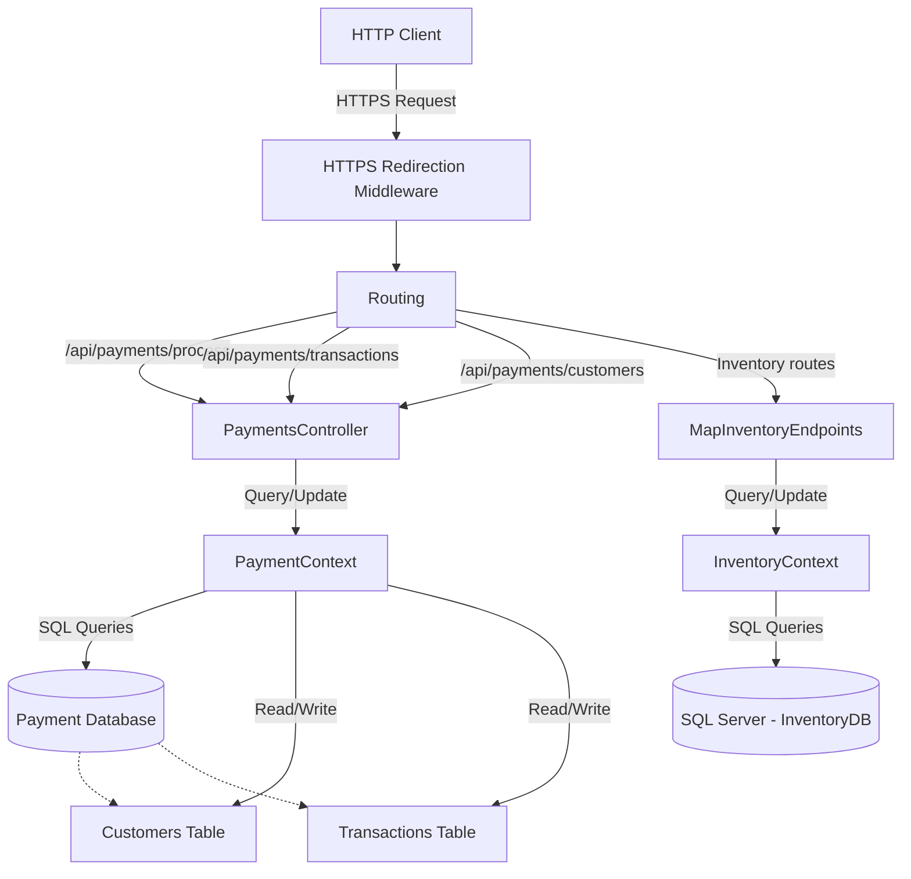
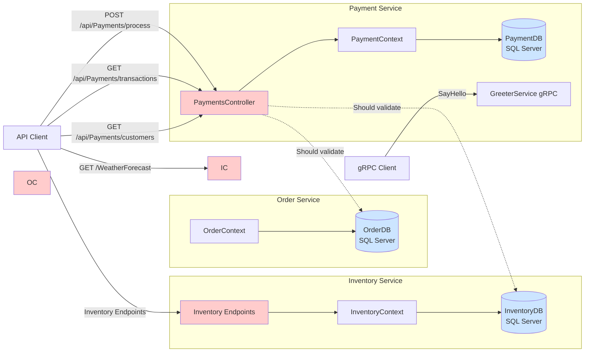

# Flow Document: Demo_FoodProvider (Minimal APIs Sample)

## 1. Purpose

Showing a sample of using Minimal APIs in dotnet. This application provides an inventory management system with integrated payment processing capabilities. It allows users to:
- Manage inventory data through API endpoints
- Process customer payments and track transactions
- View customer account balances
- Query payment transaction history

The application appears to be part of a larger food provider ecosystem, handling the backend operations for inventory tracking and financial transactions.

## 2. Main components

| Component | Responsibility | Technology |
|-----------|---------------|------------|
| Program.cs | Application bootstrapping, service registration, middleware configuration | ASP.NET Core 6+ |
| PaymentsController | Handle payment processing, retrieve transactions and customer data | ASP.NET Core MVC Controllers |
| InventoryContext | Database context for inventory data operations | Entity Framework Core |
| PaymentContext | Database context for payment and customer data operations | Entity Framework Core |
| GreeterService | gRPC service for greeting functionality | gRPC / ASP.NET Core |
| InventoryEndpoints | Minimal API endpoints for inventory operations (implementation not shown) | ASP.NET Core Minimal APIs |

## 3. Data flow



## 4. Exposed endpoints

| HTTP Method | Route | Purpose | Auth Required |
|-------------|-------|---------|---------------|
| POST | /api/payments/process | Process a customer payment and create transaction record | Not determined |
| GET | /api/payments/transactions | Retrieve all payment transactions | Not determined |
| GET | /api/payments/customers | Retrieve all customer records | Not determined |
| Not determined | (Inventory routes) | Inventory management operations via MapInventoryEndpoints | Not determined |
| GET | /swagger/v1/swagger.json | Swagger API documentation (Development only) | Not determined |

## 5. External integrations

| Integration Type | Details | Configuration Source |
|------------------|---------|---------------------|
| SQL Server Database | Connection for InventoryDB | ConnectionStrings:InventoryDB in appsettings.json |
| Database (Payment) | Payment and customer data storage (database type not explicitly shown) | Configured via PaymentContext (connection details not shown in provided code) |

**Note:** No external API integrations, message queues, or third-party services were detected in the provided code.

## 6. Authentication & security

**Authentication Mechanisms:** None configured

**Security Measures Implemented:**
- HTTPS Redirection enforced via `app.UseHttpsRedirection()`
- Swagger UI restricted to Development environment only

**Security Gaps Identified:**
- No authentication middleware (e.g., JWT, Cookie, OAuth) detected in the middleware pipeline
- No authorization policies configured
- Payment endpoints are publicly accessible without authentication
- No rate limiting or API throttling detected
- No input validation middleware observed

**Recommendation:** This application currently has no authentication or authorization mechanisms in place, which poses a significant security risk, especially for payment processing endpoints.

## 7. Required configuration

### Connection Strings
- `ConnectionStrings:InventoryDB` - SQL Server connection string for inventory database

### Application Settings
- `Logging:LogLevel:Default` - Default logging level
- `Logging:LogLevel:Microsoft.AspNetCore` - ASP.NET Core framework logging level
- `AllowedHosts` - Allowed host headers for the application

### Environment-Specific
- `ASPNETCORE_ENVIRONMENT` - Set to "Development" to enable Swagger UI

### Not Determined
- PaymentContext connection string configuration (not visible in provided code)
- Any additional configuration required by `MapInventoryEndpoints` implementation

---

**Document prepared for:** Security Team & Non-Technical Stakeholders  
**Application:** Demo_FoodProvider (Inventory & Payment Service)  
**Note:** Some components referenced in Program.cs (such as InventoryEndpoints implementation and PaymentContext configuration) were not included in the provided source code, limiting full analysis.

# API Reference: Demo_FoodProvider

## Models & DTOs

### Product
**Namespace:** `Inventory.Data`

| Property | Type | Validation | Description |
|----------|------|------------|-------------|
| Id | `int` | Primary Key, Auto-increment | Internal database identifier |
| ProductId | `string` | Required | Business product identifier |
| Name | `string` | Required | Product name |
| Price | `decimal(18,2)` | Required | Product price with 2 decimal precision |
| Stock | `int` | Required | Available inventory quantity |

**Purpose:** Represents inventory products available for ordering.

---

### Order
**Namespace:** `Order.Data`

| Property | Type | Validation | Description |
|----------|------|------------|-------------|
| Id | `int` | Primary Key, Auto-increment | Internal database identifier |
| OrderId | `string` | Required | Business order identifier |
| CustomerId | `string` | Required | Reference to customer placing order |
| ProductId | `string` | Required | Reference to ordered product |
| TotalAmount | `decimal(18,2)` | Required | Total order value |
| Status | `string` | Required | Order status (e.g., "Pending") |
| CreatedAt | `DateTime` | Required | Order creation timestamp |

**Purpose:** Represents customer orders in the system.

---

### Customer
**Namespace:** `Payment.Data.PaymentContext`

| Property | Type | Validation | Description |
|----------|------|------------|-------------|
| Id | `int` | Primary Key, Auto-increment | Internal database identifier |
| CustomerId | `string` | Required | Business customer identifier |
| Name | `string` | Required | Customer name |
| Balance | `double` | Required | Customer account balance |

**Purpose:** Represents customer payment accounts with balance tracking.

---

### Transaction
**Namespace:** `Payment.Data.PaymentContext`

| Property | Type | Validation | Description |
|----------|------|------------|-------------|
| Id | `int` | Primary Key, Auto-increment | Internal database identifier |
| OrderId | `string` | Required | Associated order reference |
| CustomerId | `string` | Required | Customer who made payment |
| Amount | `double` | Required | Transaction amount |
| Status | `string` | Required | Transaction status (e.g., "Success") |
| CreatedAt | `DateTime` | Auto-generated | Transaction timestamp |

**Purpose:** Records payment transactions for audit trail.

---

### OrderRequest (DTO)
**Namespace:** `Order.Models`

| Property | Type | Validation | Description |
|----------|------|------------|-------------|
| CustomerId | `string` | - | Customer placing the order |
| ProductId | `int` | - | Product being ordered |
| TotalAmount | `decimal` | - | Order total value |
| Status | `string` | Default: "Pending" | Initial order status |

**Purpose:** Input DTO for creating new orders.

---

### PaymentRequest (DTO)
**Namespace:** `Payment.Controllers`

| Property | Type | Validation | Description |
|----------|------|------------|-------------|
| OrderId | `int` | - | Order being paid for |
| CustomerId | `string` | - | Customer making payment |
| Amount | `decimal` | - | Payment amount |

**Purpose:** Input DTO for processing payments.
---

## Endpoints

### ⚠️ POST `/api/Payments/process`
**Controller:** `PaymentsController`

**Description:** Processes a payment by deducting amount from customer balance and creating a transaction record.

**Request Body:**
```json
{
  "orderId": 123,
  "customerId": "string",
  "amount": 99.99
}
```
Type: `PaymentRequest`

**Responses:**

| Status Code | Description | Response Body |
|-------------|-------------|---------------|
| 200 OK | Payment processed successfully | `{ "orderId": "string", "status": "Success", "remainingBalance": 0.00 }` |
| 404 Not Found | Customer not found | `"Customer not found."` |

**Business Rules:**
- Customer balance is decremented by the payment amount
- Transaction status is always set to "Success" (no validation for insufficient funds)
- Transaction is persisted to database immediately

**⚠️ Security Issue:** No authentication/authorization visible on this endpoint.

---

### ⚠️ GET `/api/Payments/transactions`
**Controller:** `PaymentsController`

**Description:** Retrieves all payment transactions in the system.

**Parameters:** None

**Responses:**

| Status Code | Description | Response Body |
|-------------|-------------|---------------|
| 200 OK | List of all transactions | `Transaction[]` |

**Business Rules:**
- Returns all transactions without filtering or pagination

**⚠️ Security Issue:** No authentication/authorization visible. Exposes all customer transaction data.

---

### ⚠️ GET `/api/Payments/customers`
**Controller:** `PaymentsController`

**Description:** Retrieves all customers in the system.

**Parameters:** None

**Responses:**

| Status Code | Description | Response Body |
|-------------|-------------|---------------|
| 200 OK | List of all customers | `Customer[]` |

**Business Rules:**
- Returns all customers without filtering or pagination

**⚠️ Security Issue:** No authentication/authorization visible. Exposes all customer data including balances.

---

### ⚠️ GET `/WeatherForecast`
**Controller:** `WeatherForecastController` (multiple instances)

**Description:** Returns a 5-day weather forecast with random data (template/demo endpoint).

**Parameters:** None

**Responses:**

| Status Code | Description | Response Body |
|-------------|-------------|---------------|
| 200 OK | Array of 5 weather forecasts | `WeatherForecast[]` |

**Business Rules:**
- Generates random temperatures between -20°C and 55°C
- Returns forecasts for the next 5 days

**⚠️ Security Issue:** No authentication/authorization visible.

**Note:** This endpoint exists in multiple namespaces (Inventory, Order, Payment, OrdersService) - appears to be template code that should be removed.

---

### Inventory Endpoints
**Note:** The code includes `app.MapInventoryEndpoints()` in Program.cs, but the endpoint definitions are not provided in the source code. These would need to be documented separately.

---

## Services

### GreeterService (gRPC)
**Namespace:** `PaymentsService.Services`  
**Base Class:** `Greeter.GreeterBase`

**Responsibility:** Provides a gRPC greeter service (appears to be template code).

**Public Methods:**

#### `SayHello`
```csharp
public override Task<HelloReply> SayHello(HelloRequest request, ServerCallContext context)
```
- **Parameters:**
  - `request` (`HelloRequest`): Contains name field
  - `context` (`ServerCallContext`): gRPC server context
- **Returns:** `Task<HelloReply>` with greeting message
- **Description:** Returns "Hello {name}" response

---

## Architecture Diagram



**Legend:**
- **Red/Pink nodes**: Controllers/Endpoints (⚠️ lacking authentication)
- **Blue nodes**: Databases
- **Solid lines**: Direct dependencies
- **Dotted lines**: Missing validations/integrations

---

## Security & Architectural Concerns

1. **⚠️ No Authentication:** All endpoints lack visible authentication/authorization attributes
2. **⚠️ No Payment Validation:** Payment processing doesn't validate sufficient balance before deducting
3. **⚠️ Data Exposure:** Customer and transaction endpoints expose all records without filtering
4. **⚠️ Missing Integration:** Payment service doesn't validate orders or inventory exist
5. **Template Code:** Multiple WeatherForecast controllers should be removed from production
6. **Type Inconsistency:** ProductId is `int` in OrderRequest but `string` in Product model
7. **Missing Pagination:** List endpoints return all records without pagination support

---

**Document Version:** 1.0  
**Generated From:** Source code analysis  
**Note:** Inventory endpoint details are not available in provided source code.
